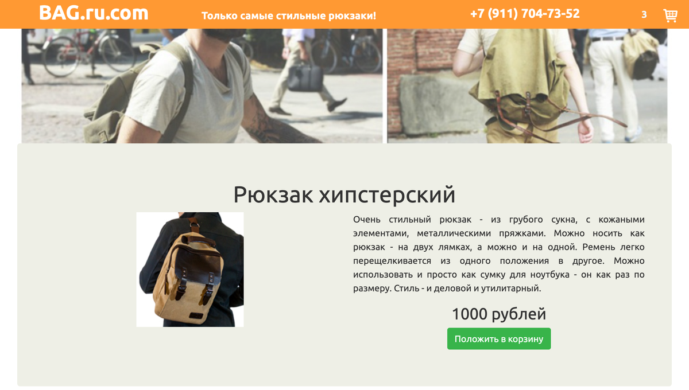

# BAG.ru.com

*[Русская версия](README.ru.md)*

A single-page backpack shop built in February 2018 on React 16 and Redux — a product catalogue with
descriptions, prices and a cart counter in the header. I built it to sell backpacks, which I was
actually doing at the time.

---

## The problem

I was selling backpacks and needed somewhere to send people. A catalogue is a small problem with two
awkward parts.

- **The cart lives in the header, the buttons live in the cards.** Pressing "add to basket" inside a
  product card has to update a counter three levels up in a different branch of the tree. Passing a
  callback down and a count back up through every intermediate component is how a catalogue page
  turns into prop plumbing.
- **Products are content, not markup.** Five backpacks today, fifteen next month. If a new item means
  editing JSX, adding an item is a developer task forever.
- **Backpacks are sold by the photograph.** The product copy matters less than the picture, and the
  picture has to be sharp on a phone and not weigh three megabytes on a desktop — which means
  multiple sizes of every shot, not one.
- **A shop needs to not look like a school project.** One person, no designer.

## The solution

Redux for exactly one thing: the cart. `ItemsList` dispatches `addItem`, the `basket` reducer appends
to an array, and `HeaderMenu` reads the length through `connect` — the product card and the counter
never learn about each other, and no callback is threaded through the middle.

Products live in [`src/db/items.js`](src/db/items.js) as an array of objects — id, name, price,
photo, description. Adding an item is adding an object; nothing in the components changes. The name
of the folder is not an accident: it is a database in the only sense the site needed.

Every backpack shot is exported at 200/400/800 px alongside the original, so a card can ask for the
size it actually needs.

Layout is Bootstrap 3 through `react-bootstrap`, with a parallax header driven by a scroll listener
in `HeaderMenu`.

---

## What it looks like



Three items in the cart — the counter in the header is Redux state, updated from the buttons inside
the cards.

---

## Getting started

The project is a Create React App of early 2018, so modern Node needs the legacy OpenSSL flag:

```bash
git clone https://github.com/ZergMaster/bagrucomReact.git && cd bagrucomReact
npm install
NODE_OPTIONS=--openssl-legacy-provider npm start     # http://localhost:3000
```

Products are in [`src/db/items.js`](src/db/items.js), their photos in `src/img/bags/`. That is
everything you need to touch to change the catalogue.

**One fix was needed to get here:** `redux` and `react-redux` were imported throughout but missing
from `package.json`, so the project could never be installed and run from a clean clone. They are in
the dependencies now — the screenshot above is this repository actually running, in 2026.

---

## Who used it, and what changed

I used it, to sell backpacks. It is a real shop for a real, small business of mine, not a course
exercise — the phone number in the header is my own, and the products are the ones I had.

Read as a work sample it is the oldest React in this profile and it shows: class components,
`PureComponent` with a hand-assigned `this.props`, Bootstrap 3, a `db` folder that is a JS array. I
am not going to pretend those were good calls, and I would not write any of it that way now.

What is worth pointing at is the one architectural decision that was right and has stayed right: the
catalogue is data, the components are a renderer, and adding a product is not a code change. Two
years later at Playkot that same separation — content as data that a non-engineer edits, code as the
thing that renders it — is what the whole LiveOps pipeline was built on. Here it is with five
backpacks in it.

---

## Tech

React 16 · Redux 3 · react-bootstrap (Bootstrap 3) · Create React App 1.1
